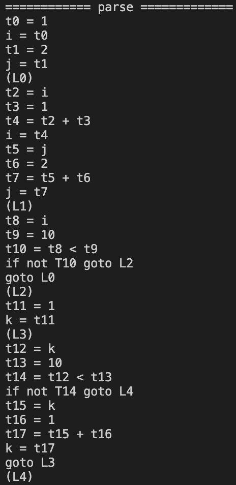

# Compiler

## 語法

```
PROG = STMTS
BLOCK = { STMTS }
STMTS = STMT*
STMT = WHILE | BLOCK | ASSIGN
WHILE = while (E) ( STMT | END )
DO = do STMT while (E)
ASSIGN = id '=' E;
E = F (op E)*
F = (E) | Number | Id
```

## **Main changes**
- DO()
    - New function for do_while 
- WHILE()
    - Edit and make WHILE() function compatible to **do_while loop** and **while loop**

## **do.c**

```
i = 1;
j = 2;
do{
    i = i + 1;
    j = j + 2;
}
while(i<10);

k = 1;
while (k<10) k = k + 1;
```

## **Result**


```
(base) wongweixiang@Wongs-Air Exe2 % ./compiler test/do.c

i = 1;
j = 2;
do{
    i = i + 1;
    j = j + 2;
}
while(i<10);

k = 1;
while (k<10) k = k + 1;
========== lex ==============
token=i
token==
token=1
token=;
token=j
token==
token=2
token=;
token=do
token={
token=i
token==
token=i
token=+
token=1
token=;
token=j
token==
token=j
token=+
token=2
token=;
token=}
token=while
token=(
token=i
token=<
token=10
token=)
token=;
token=k
token==
token=1
token=;
token=while
token=(
token=k
token=<
token=10
token=)
token=k
token==
token=k
token=+
token=1
token=;
========== dump ==============
0:i
1:=
2:1
3:;
4:j
5:=
6:2
7:;
8:do
9:{
10:i
11:=
12:i
13:+
14:1
15:;
16:j
17:=
18:j
19:+
20:2
21:;
22:}
23:while
24:(
25:i
26:<
27:10
28:)
29:;
30:k
31:=
32:1
33:;
34:while
35:(
36:k
37:<
38:10
39:)
40:k
41:=
42:k
43:+
44:1
45:;
============ parse =============
t0 = 1
i = t0
t1 = 2
j = t1
(L0)
t2 = i
t3 = 1
t4 = t2 + t3
i = t4
t5 = j
t6 = 2
t7 = t5 + t6
j = t7
(L1)
t8 = i
t9 = 10
t10 = t8 < t9
if not T10 goto L2
goto L0
(L2)
t11 = 1
k = t11
(L3)
t12 = k
t13 = 10
t14 = t12 < t13
if not T14 goto L4
t15 = k
t16 = 1
t17 = t15 + t16
k = t17
goto L3
(L4)
``` 